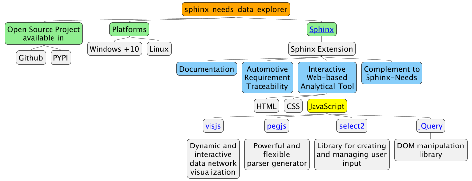

## About

 

`sphinx_needs_data_explorer` enhances the interactivity of your Sphinx   generated documentation by enabling you to explore [Sphinx-Needs](https://github.com/useblocks/sphinx-needs) data.

 

## Goals and Realization

 

 

## Screenshots

**Example 1:** exploring In-Neighbours, Our-Neighbours or both

 

**Example 2:** switching between network visualization and documentation

 

**Example 3:** interaction

 

## Installation

You can install the package with pip (TBD)

    pip install sphinx-needs-data-explorer

Alternatively (Linux)

    git clone https://github.com/mi-parkes/sphinx-needs-data-explorer.git
    cd sphinx-needs-data-explorer
    
    python3 -m venv .venv
    source .venv/bin/activate
    pip install -r doc/requirements.txt
    
    python3 -m build --wheel
    pip install dist/sphinx_needs_data_explorer-0.7.0-py3-none-any.whl

## Activation

In your conf.py configuration file, add `sphinx_needs_data_explorer` to your extensions list. And, please, make sure that `sphinx_needs` extension is configured to generate needs.json file in the root of your documentation E.g.:

    extensions = [
      ...
      'sphinx_needs_data_explorer'
      ...
    ]
    ...
    needs_build_json = True

Add the following role in your index.rst file (At this moment the role can be used only in the RST files stored in the same directory as conf.py).

    :sphinx_needs_data_explorer:`Sphinx Needs Data Explorer`

## Configuration

If defined, the following parameters are used for configuration:

* [needs_extra_links](https://sphinx-needs.readthedocs.io/en/latest/configuration.html#needs-extra-links) - the parmeter defines the type links to use when extracting sphinx-needs linkage
* [needs_types](https://sphinx-needs.readthedocs.io/en/latest/configuration.html#needs-types) - the parameter defines sphinx-needs types and their attributes like node colors

