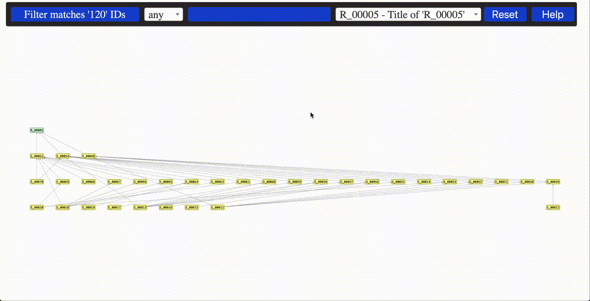

## About

`sphinx_needs_data_explorer` enhances the interactivity of your Sphinx-generated documentation by enabling you to explore [Sphinx-Needs](https://github.com/useblocks/sphinx-needs) data.

Example 1: exploring In-Neighbours, Our-Neighbours or both

Example 2: switching between network visualization and documentation

Example 3: interaction

## Installation

You can install the package with pip

    pip install sphinx-needs-data-explorer

Alternatively

    git clone https://github.com/mi-parkes/sphinx-needs-data-explorer.git
    cd sphinx-needs-data-explorer
    python -m build --wheel
    pip install dist/sphinx_needs_data_explorer-0.7.0-py3-none-any.whl

## Activation

In your conf.py configuration file, add `sphinx_needs_data_explorer` to your extensions list. And, please, make sure that `sphinx_needs` extension is configured to generate needs.json file in the root of your documentation E.g.:

    extensions = [
      ...
      'sphinx_needs_data_explorer'
      ...
    ]
    ...
    needs_build_json = True

Add the following role in your index.rst file.

    :sphinx_needs_data_explorer:`Sphinx-Needs Data Explorer`

## Configuration

The following configuration parameters are supported:

* link_types - defines lists of all link types in your traceability network to be explored
* type_color_map - assigns specific color to each Sphinx-Needs type

      sphinx_needs_data_explorer_config = {
        'link_types':['links','verifies'],
        'type_color_map': {
            'req'   :'#DEFFDC',
            'spec'  :'#FFFF99',
            'test'  :'#87CEFA'
        }
      }
